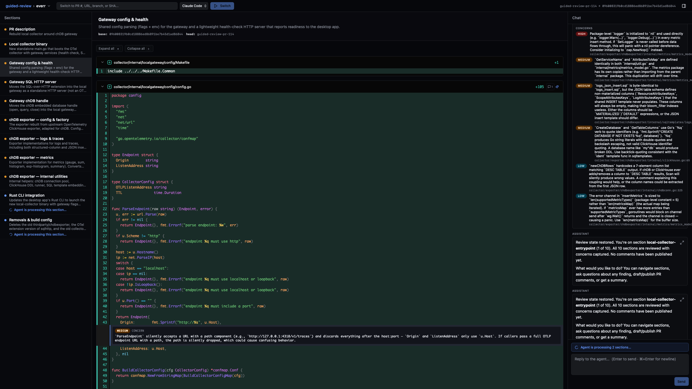

# Guided Review

Guided Review is a desktop app for reviewing GitHub pull requests with help from
ACP-compatible coding agents.

Instead of reading one large diff at once, you pick a PR and let the app organize
it into smaller sections. The diff, section list, chat, and comment drafts stay in
one window, so you can keep your place while the agent helps you inspect the
change.



## Why Use It

Pull request reviews are easier when you have a clear path through the change.
Guided Review asks an ACP agent to propose review sections, walks through those
sections one at a time, and keeps suggested comments as drafts until you approve
them.

It is not meant to replace your judgment. It is a way to get practical help from
the coding agents already available on your machine.

## What It Does

- Opens a local Git repository.
- Accepts a GitHub PR number or PR URL.
- Fetches the PR into the selected local repository.
- Shows the PR description, changed files, review sections, chat, and draft
  comments together.
- Lets you ask the agent questions while staying focused on the current section.
- Blocks mismatched PR URLs when they do not match the selected repository.
- Waits for your approval before asking the agent to publish comments.

## How It Works

1. Choose a local repository folder.
2. Enter a PR number, such as `123`, or paste a GitHub PR URL.
3. Pick an available ACP review agent.
4. Start the review.
5. Walk through the generated sections.
6. Approve only the comment drafts you want posted.

## Requirements

To run Guided Review from source, you need:

- Node.js and npm.
- Rust and Cargo.
- Git.
- GitHub CLI (`gh`) for PR details and existing review comments.
- The system dependencies required by Tauri for your OS.
- Authentication for the ACP review agent you choose in the app.

The agent also needs its own GitHub access if you want it to publish approved
comments.

## Run From Source

Install dependencies:

```sh
npm install
```

Start the desktop app:

```sh
npm run tauri -- dev
```

You can also start only the Vite frontend:

```sh
npm run dev
```

The frontend-only command is useful for UI work, but Tauri features are not
available there.

## Development

Useful commands:

```sh
npm run check
npm test
npm run build
npm run tauri -- build
```

- `npm run check` runs TypeScript checks.
- `npm test` runs the unit tests.
- `npm run build` builds the frontend.
- `npm run tauri -- build` builds the desktop app.

For contribution details, see [CONTRIBUTING.md](CONTRIBUTING.md).

## Release Notes

Local and CI release flows live in `scripts/local-release.mjs` and
`.github/workflows/release.yml`. Maintainers can bump the app version with:

```sh
npm run bump-version -- patch
```

You can also pass `minor`, `major`, or an exact version like `1.2.3`.
